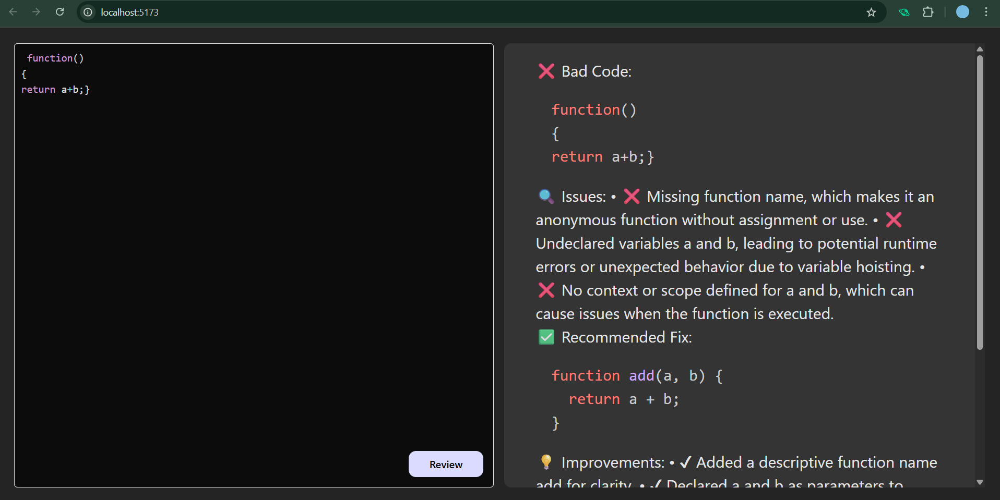
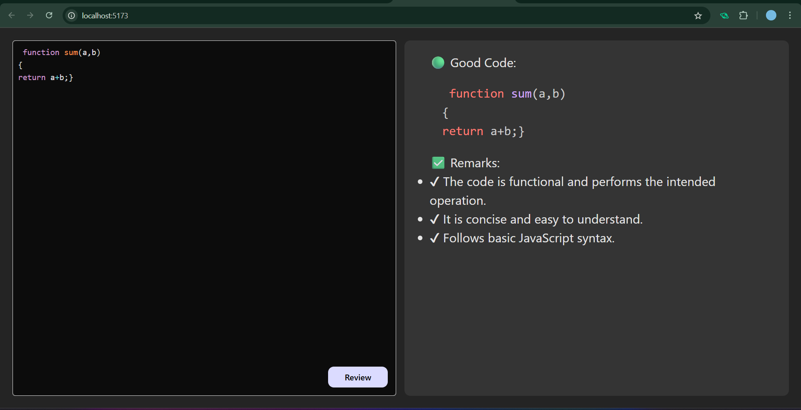

[](https://ai-code-review-frontend-ccsd.onrender.com)

# AI Code Review Tool

This is a full-stack AI-powered Code Review Tool that allows users to input code and get intelligent, markdown-based feedback from an AI. It's built using a React frontend and an Express.js backend, integrating OpenAI for AI responses.

🎯 **Live Demo:** [Click here to visit the app](https://ai-code-review-frontend-ccsd.onrender.com)

---

## Features

- AI-Powered Code Review
- Clean and Simple UI
- Real-Time Syntax Highlighting with PrismJS
- Markdown Output Rendering
- Easy-to-use Interface

---

## Screenshots

### Code Editor Interface



### AI Feedback Output




---

## Getting Started

### Prerequisites

- Node.js
- npm or yarn
- OpenAI API Key (for AI integration)

---

## Installation

### Backend

```bash
cd backend
npm install
npm start
